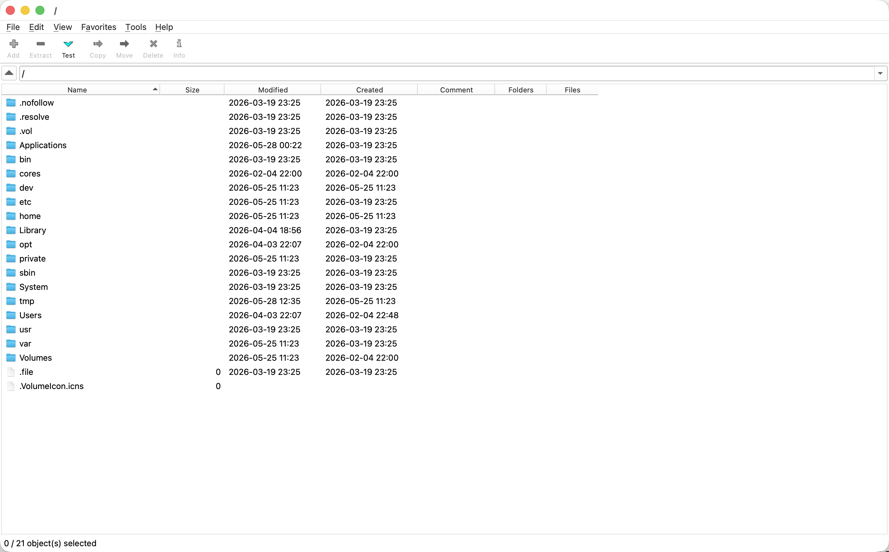
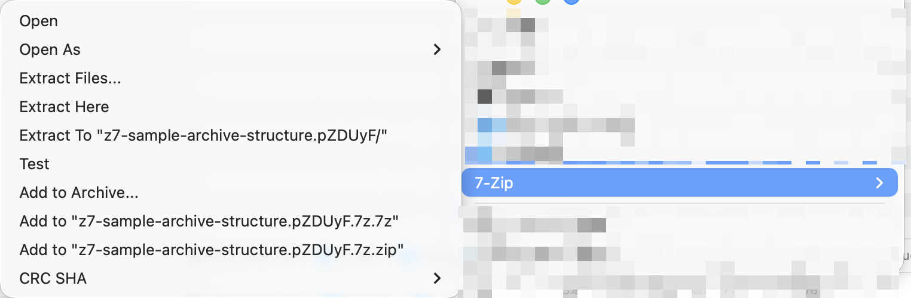
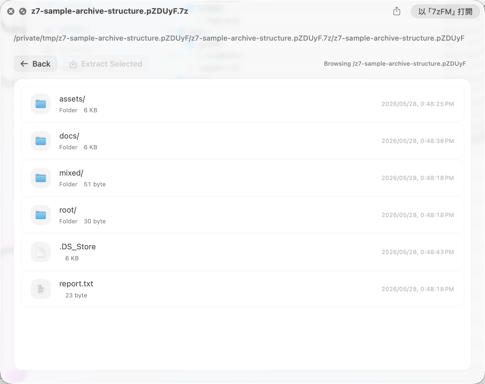
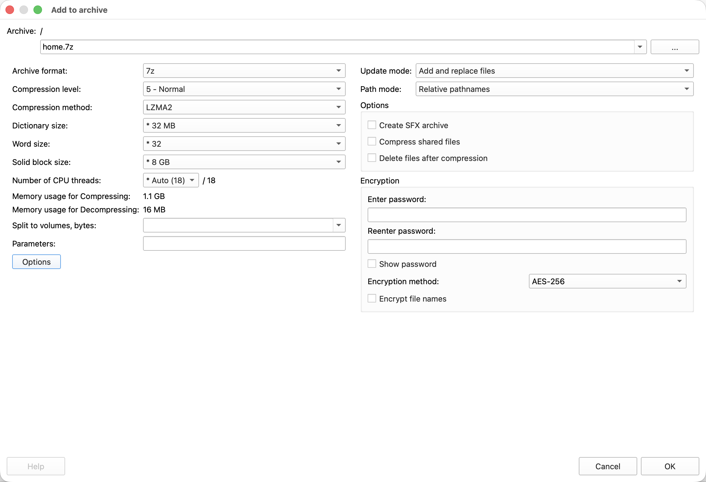
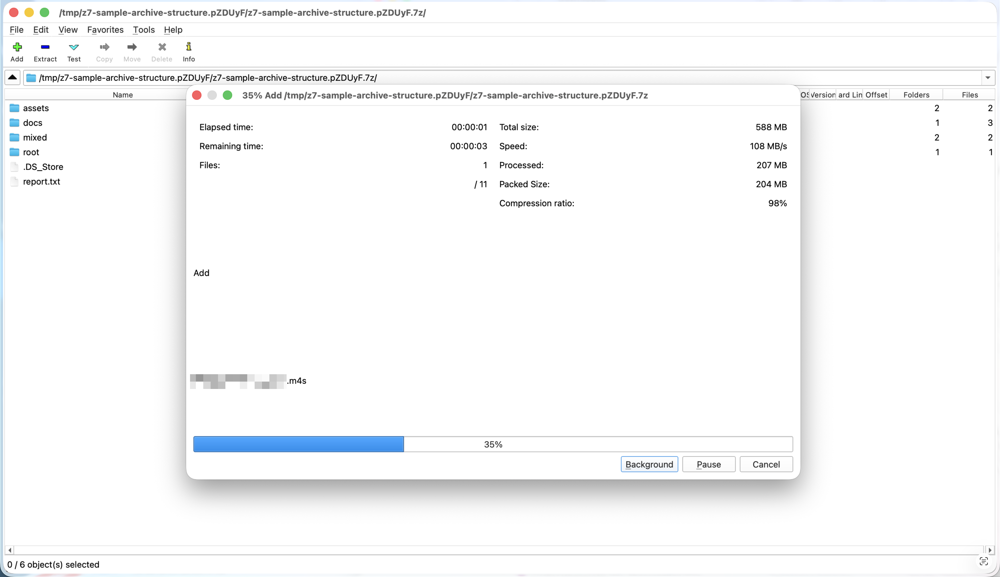
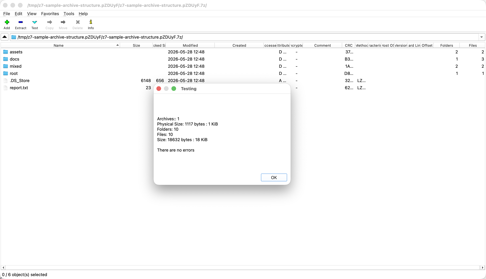
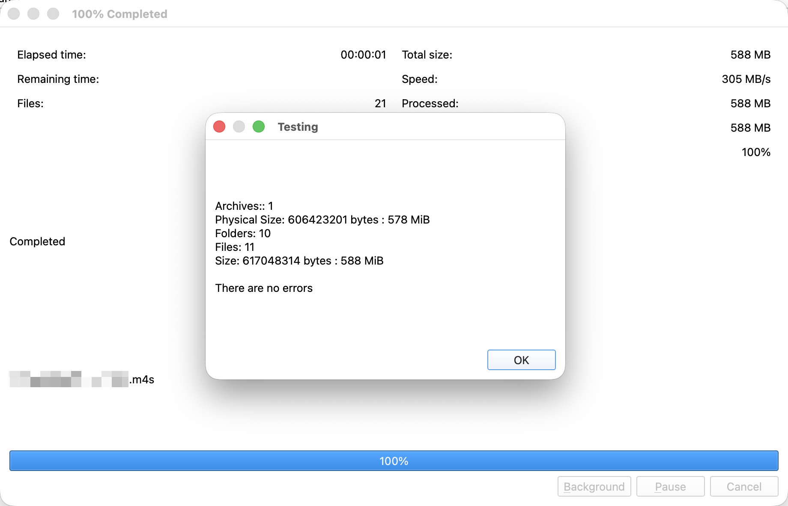
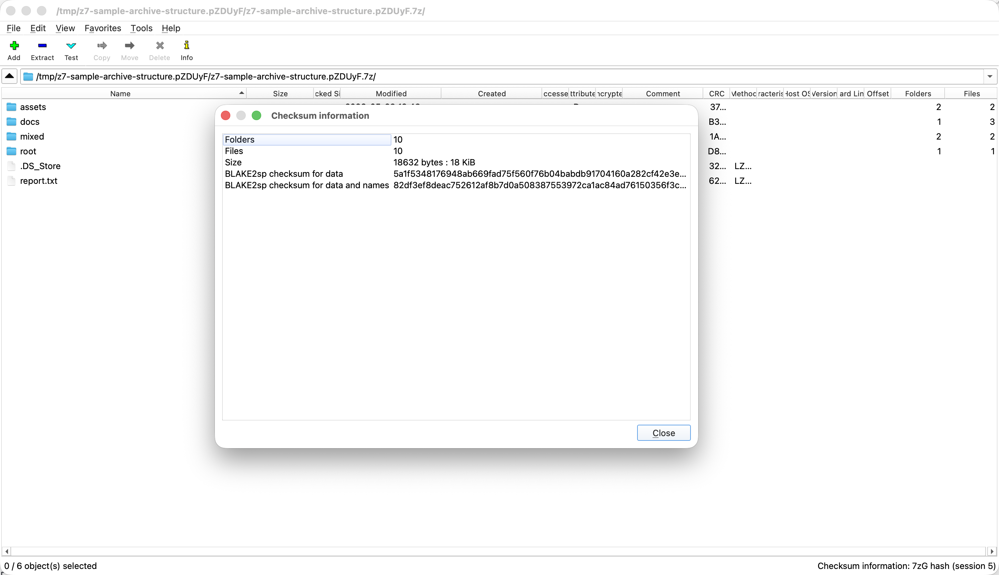

# 7zFM Qt Edition

A Qt edition of the 7-Zip, with Finder Sync, Quick Look.

This repository is primarily developed and validated on macOS.

## Screenshots

















## Highlights

- Two-panel File Manager for browsing disks and archives with original-style 7-Zip commands.
- Finder Sync actions for compress, extract, test, and CRC from the macOS context menu.
- Quick Look previews for archive contents without opening the full app.
- 7zG add, extract, test, and CRC windows launched from 7zFM or shell integration.
- Qt drag/drop and macOS native integration for archive-centric file workflows.

## macOS Build

```sh
brew install llvm clang # Recommended, without these may not build, needs verification.
cmake --preset {dev,release,native}
cmake --build --preset {dev,release,native}
```

```sh
cmake --build --target deploy_macos
```

The final CMake bundle is:

```text
build/{preset}/deploy/7zFM.app
```

Assemble final release of Finder Sync and Quick Look extensions to final app bundle with:

```sh
src/macos_integration/xcode_project/scripts/build.sh release
packaging/macos/copy_xcode_extensions.sh
```

The copy step uses `build/release/deploy/7zFM.app` as the only destination, places the `.appex` bundles under `Contents/PlugIns`, rewrites runtime links to the bundled frameworks/runtimes, and signs the app ad hoc for local testing.

For manual macOS extension testing, run the Xcode products from DerivedData or install the final bundle as `/Applications/7zFM.app`. Ad hoc signed Finder Sync and Quick Look extensions may be rejected by macOS when the app is run from arbitrary folders, even if the bundle layout is otherwise correct.

For a host-tuned release build, use the existing `release-native` preset in place of `release` for the CMake app build.
